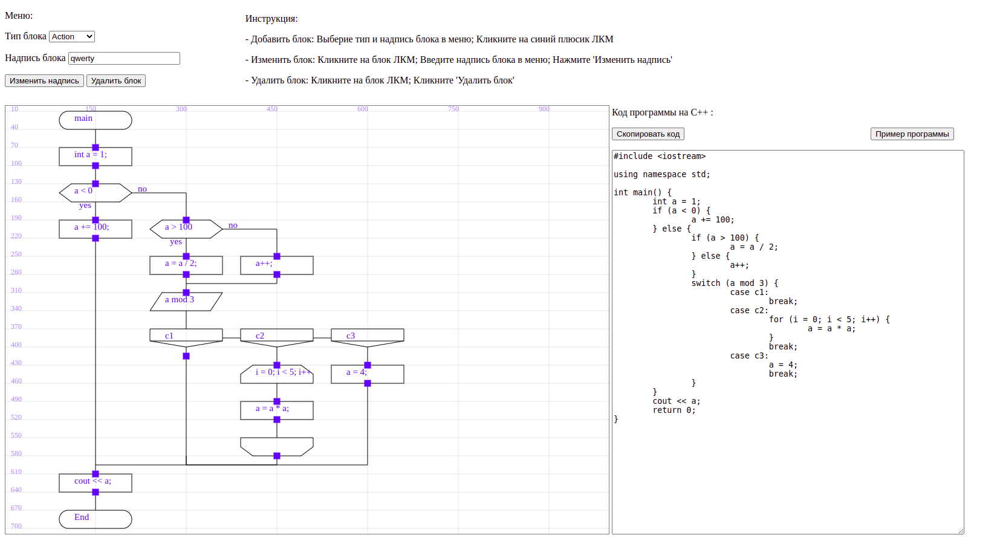

---
#Компилятор структурного подмножества графического языка ДРАКОН в программу на языке С++
ДРАКОН — разновидность блок-схем. Пользователь на холсте рисует схему в обозначениях ДРАКОНа
(только его структурное подмножество), в элементах схемы вводит выражения языка С++ 
(их синтаксис не проверяется). Затем полученная программа сама компилируется в С++ исходник,
где стрелки превращаются в if/for и т.д., выражения из элементов выписываются как есть.

---
## Функционал
    - Добавить блок
    - Изменить блок
    - Удалить блок

---
## Инструкция
#### Добавить блок:
    1) Выбрать тип блока в меню
    2) Ввести надпись блока в меню
    3) Кликнуть на синий плюсик

#### Изменить блок:
    1) Кникнуть на блок ЛКМ
    2) Ввести надпись блока в меню
    3) Нажать 'Изменить надпись'

#### Удалить блок:
    1) Кникнуть на блок ЛКМ
    2) Кликнуть 'Удалить блок'

---
## Резульатат
